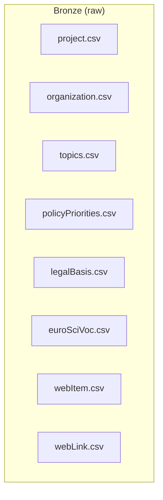
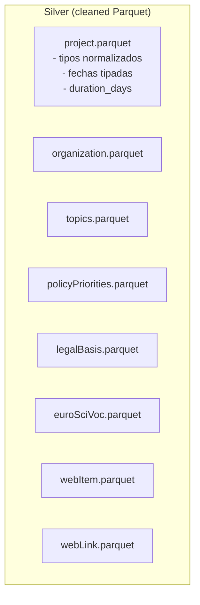
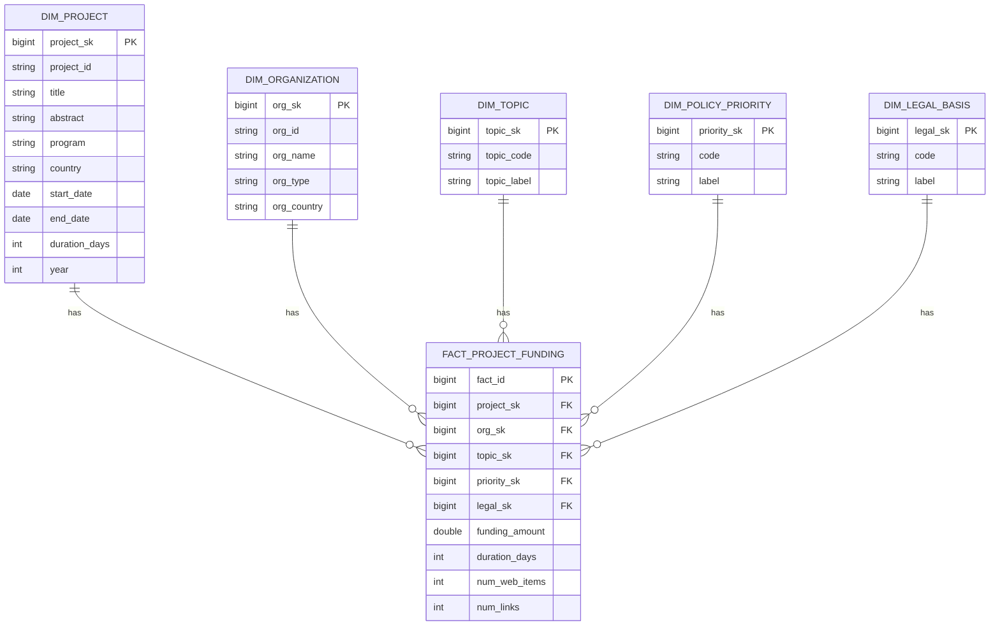

# Lakehouse (pandas) – EU Research Projects

> Medallion Architecture (Bronze/Silver/Gold) con **pandas + Parquet**, **Supabase (Postgres)** para consumo (Gold), **Typesense** para búsqueda con filtros y **FastAPI** como API.
> Diseñado para sonar “Databricks-ready”, pero simple de ejecutar localmente.

---

## 🧭 Arquitectura

- **Data Lake local (filesystem)**

  - `lake/bronze/` → archivos crudos (CSV, JSON, PDF opcional)
  - `lake/silver/` → datos limpios/normalizados en **Parquet**
  - `lake/gold/` → **esquema estrella** (dimensiones + hecho) en **Parquet**
- **ETL**: Python + **pandas**

  - `etl/bronze_to_silver.py`
  - `etl/silver_to_gold.py`
  - `etl/sync_to_supabase.py` → carga Gold a **Supabase (Postgres)** con SQLAlchemy
- **API**: **FastAPI** (Basic Auth)

  - `/seed` → corre ETL end-to-end
  - `/raw` → CRUD mínimo de archivos en Bronze
  - `/gold/...` → consultas a Supabase (dim/fact)
  - `/search` → **Typesense** (texto + filtros)
- **Search**: **Typesense** (colección `projects_search`)

  - Campos: `project_id, title, abstract, country (facet), year (facet)`

> En Databricks: reemplazás Parquet por **Delta Lake en DBFS/S3**, pandas por **PySpark** en notebooks, y Supabase por **SQL Warehouse**. Los endpoints API y Typesense se mantienen.

---

## 📁 Estructura

```
.
├─ api/
│  ├─ main.py
│  ├─ auth.py
│  ├─ routes/
│  │  ├─ seed.py
│  │  ├─ raw.py
│  │  ├─ gold.py
│  │  └─ search.py
│  ├─ services/
│  │  ├─ db.py
│  │  └─ typesense_client.py
│  └─ domain/
│     ├─ raw_models.py
│     └─ gold_models.py
├─ etl/
│  ├─ bronze_to_silver.py
│  ├─ silver_to_gold.py
│  └─ sync_to_supabase.py
├─ data/
│  ├─ bronze/   # CSV crudos (pegá acá tus archivos)
│  ├─ silver/   # parquet limpios (salida ETL)
│  └─ gold/     # parquet star schema (salida ETL)
├─ Dockerfile
├─ docker-compose.yml
├─ requirements.txt
└─ README.md
```

---

## 🚀 Puesta en marcha

1) **Variables de entorno** – crea `.env`:

```
BASIC_AUTH_USER=admin
BASIC_AUTH_PASS=supersecret

# Supabase / Postgres
SUPABASE_DB_URL=postgresql+psycopg://<user>:<pass>@<host>:6543/postgres?sslmode=require

# Typesense
TYPESENSE_API_KEY=xyz
TYPESENSE_HOST=typesense
TYPESENSE_PORT=8108
```

2) **Datos crudos**
   Copiá los CSV a `data/bronze/` (ej.: `project.csv`, `organization.csv`, `topics.csv`, `policyPriorities.csv`, `legalBasis.csv`, `euroSciVoc.csv`, `webItem.csv`, `webLink.csv`).
3) **Levantar servicios**

```bash
docker compose up -d --build
```

4) **Seed end-to-end (ETL + carga a Supabase)**

```bash
curl -u admin:supersecret -X POST http://localhost:8000/seed
```

5) **Inicializar e indexar búsqueda**

```bash
curl -u admin:supersecret -X POST http://localhost:8000/search/init
curl -u admin:supersecret -X POST http://localhost:8000/search/index
```

6) **Consultar Gold (Supabase)**

```bash
curl -u admin:supersecret "http://localhost:8000/gold/projects?country=DE&year=2022"
```

7) **Buscar (Typesense)**

```bash
curl -u admin:supersecret "http://localhost:8000/search?query=horizon&country=ES&year=2023"
```

8) **CRUD Raw**

```bash
# Crear/actualizar archivo en bronze
curl -u admin:supersecret -X POST http://localhost:8000/raw   -H "Content-Type: application/json"   -d '{"filename":"new_data/sample.csv","content":"col1,col2\nA,1\nB,2"}'

# Listar archivos
curl -u admin:supersecret "http://localhost:8000/raw/list"
```

---

## ✅ Requisitos de la Prueba (Checklist)

- [X] **Medallion Architecture** (Bronze/Silver/Gold)
- [X] **SQL DB accesible** (Supabase/Postgres)
- [X] **ORM/Modelado** con SQLAlchemy (carga vía `to_sql`)
- [X] **Esquema estrella** (≥1 fact, ≥5 dims: `dim_project`, `dim_organization`, `dim_topic`, `dim_policy_priority`, `dim_legal_basis`, `dim_time` opcional)
- [X] **API FastAPI** (Basic Auth) con **CRUD batch/single** (raw), **/seed**, **/gold**, **/search**
- [X] **Vector DB**: Typesense en Docker (búsqueda + filtro)
- [X] **Type hints / Pydantic** en dominio API
- [X] **Diagramas Mermaid** (ver abajo)

> Opcionales sugeridos (si querés sumar):
>
> - Calendar table (`dim_time`)
> - Materialized Views (en Supabase)
> - Lint + mypy + tests (pytest)
> - JWT + versionado de API (`/v1`, `/v2`)
> - Data lineage (logs, hashes, versionado de Parquet)

---

## 🧭 Diagramas (Mermaid)

### 1) Lakehouse Global

```mermaid
flowchart LR
  subgraph Source["Source (CSV/JSON/PDF)"]
    A[project.csv]
    B[organization.csv]
    C[topics.csv]
    D[policyPriorities.csv]
    E[legalBasis.csv]
    F[euroSciVoc.csv]
    G[webItem.csv]
    H[webLink.csv]
  end

  A & B & C & D & E & F & G & H --> BR[Bronze (Filesystem)]
  BR -->|pandas ETL| SI[Silver (Parquet)]
  SI -->|modelado estrella| GO[Gold (Parquet)]

  GO -->|sync to_sql| DB[(Supabase / Postgres)]
  GO -->|index docs| VS[(Typesense)]

  subgraph API["FastAPI (Basic Auth)"]
    R1[/seed/]
    R2[/raw/]
    R3[/gold/.../]
    R4[/search/]
  end

  R1 --> BR
  R3 --> DB
  R4 --> VS
```

### 2) Bronze (Landing)



### 3) Silver (Conformed)



### 4) Gold (Star Schema)



---

## 📜 Licencia

MIT (o la que prefieras).
